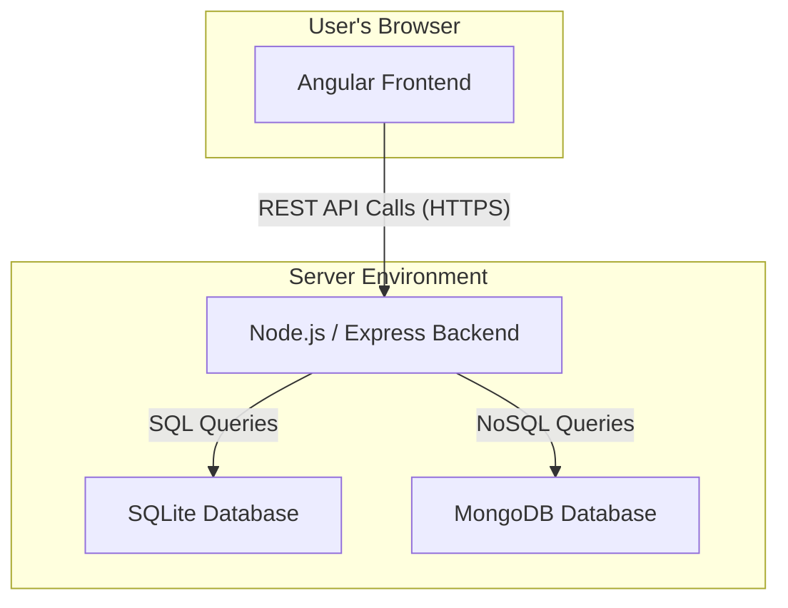
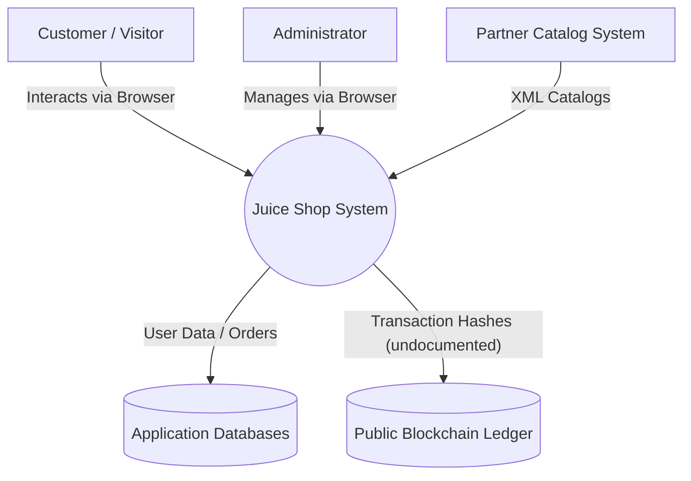
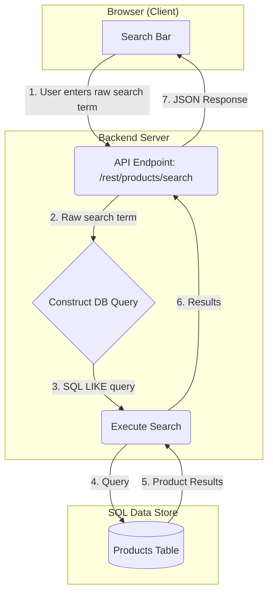
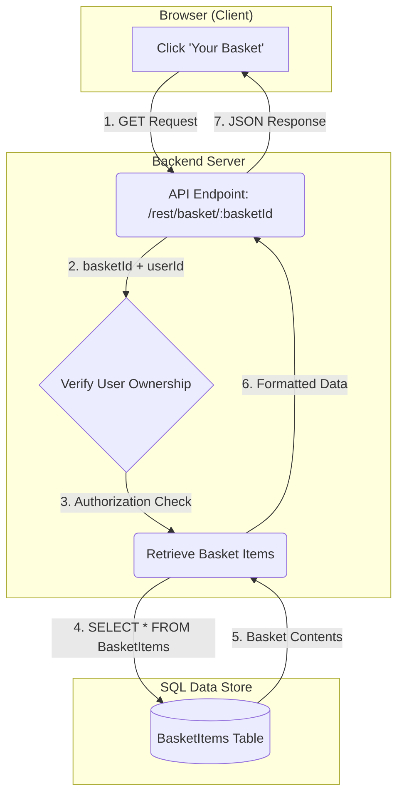
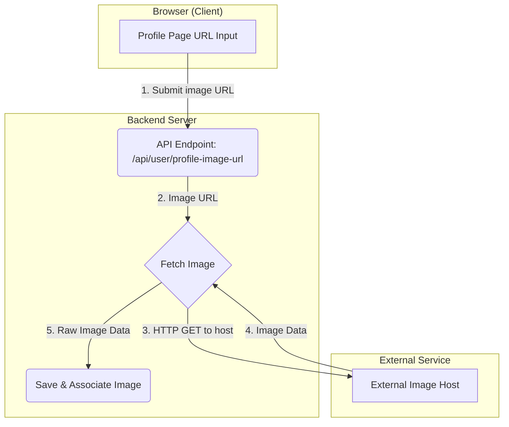
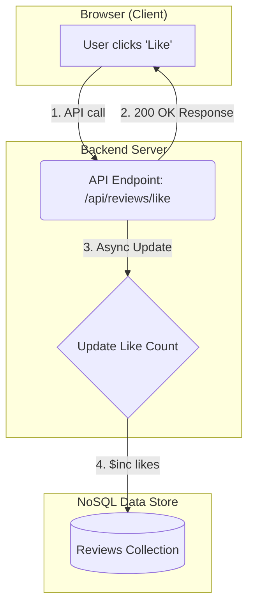

# Architecture & Data Flow Diagrams

**Document Version:** 1.0  
**Status:** Final  
**Author:** Abhishek Shrivastav  
**Date:** August 12, 2025

---

## 1. High-Level Architecture

The OWASP Juice Shop is a **modern, monolithic web application** following a classic **three-tier architecture**:

- **Client-Side (Frontend):**
  - Responsive SPA built with **Angular**.
  - Runs in the user’s browser.
  - Handles UI rendering & interactions.

- **Server-Side (Backend):**
  - RESTful API built with **Node.js & Express**.
  - Handles business logic, data processing, and communication with data stores.
  - Exposes `/logs/` endpoint for log file access.

- **Data Stores (Hybrid Model):**
  - **SQLite** (lightweight relational DB) for users, products, baskets.
  - **MongoDB** for unstructured data (reviews, feedback).



**Trust Boundaries:**
- **Internet → Client** (user to frontend)
- **Client → Server** (critical, must validate all inputs)
- **Server → Data Stores** (app to DBs)

---

## 2. Context Diagram (Level 0 DFD)

The Juice Shop as a single process and its external interactions:



---

## 3. Detailed Data Flow Diagrams (DFDs)

### 3.1 Product Search (User Story 2.1)



---

### 3.2 Viewing Shopping Basket (User Story 3.2)



---

### 3.3 Updating Profile Picture from URL (User Story 1.4)



---

### 3.4 Liking a Product Review (User Story 4.1)



---

### 3.5 B2B Bulk Order Upload (User Story 5.2)

```mermaid
graph TD
    subgraph "Browser (Admin)"
        A[Admin Uploads File]
    end
    subgraph "Backend Server"
        B(API Endpoint: /api/b2b/order)
        C{Parse File}
        D(Create Orders)
    end
    subgraph "Data Store"
        E[(Orders Table)]
    end
    A -- "1. Upload JSON/XML" --> B
    B -- "2. Raw File Data" --> C
    C -- "(Processes external entities in XML)" --> B
    C -- "3. Parsed Data" --> D
    D -- "4. INSERT into Orders" --> E
